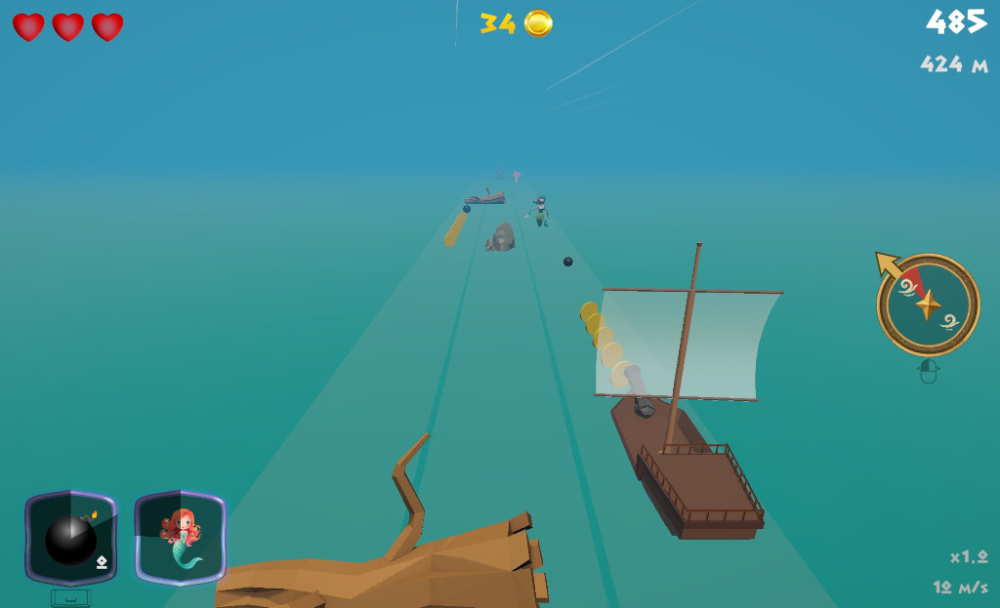

# Odysseia

Un infinite runner mythologique dans lequel vous incarnez Ulysse à bord de son navire qui doit rentrer à Ithaque.

## 🎯 Contexte

Ce jeu a été créé lors d'une formation avec pour contraintes :

- Création d’un jeu vidéo 3D avec le langage C# et le moteur Unity
- Jeu de type Infinite Runner
- Découpage en scènes
- Persistance de données via un fichier JSON
- Génération procédurale du parcours en temps réel
- Différentes phases de jeu (le gameplay doit évoluer dans le temps)
- Du mouvement dans les scènes (entités en mouvement au minimum)
- Pas d'utilisation de l'asset store hors assets graphiques.

## 📖 Documents

- [Manuel d'utilisation](docs/notice.md)
- [Document technique](docs/tech.md)
- [Synthèse des compétences](docs/skills.md)
