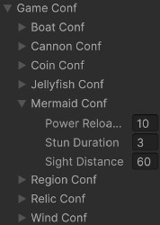
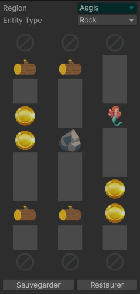

# Documentation technique

## Structure des fichiers

- `Data/` : les différentes ressources du jeu (images, polices, niveaux)
- `Sources/` : le code source de la logique métier
  - `Core/` : mécaniques de jeu
  - `Scenes/` : tout ce qui est spécifique aux scènes
  - `Toolbox/` : utilitaires génériques
- `Tests/` : tests unitaires
- `Unity/` : tout ce qui est spécifique au moteur de jeu
    - `Configuration/` : assets issus de ScriptableObjects
    - `Editor/` : configuration pour l'affichage de certains types dans l'Inspector
    - `Scenes/` : les scènes Unity
    - `Scripts/` : le code source du renderer

## Séparation mécaniques et UI

Comme pour le projet précédent, j'ai choisi de séparer la partie mécaniques de jeu et l'interface utilisateur.[^1]
Cela me permet d'utiliser du C# pur pour toute la logique métier et ne pas avoir d'overhead lié aux MonoBehaviours mais aussi de pouvoir porter le jeu vers un autre moteur ou framework si besoin.

De plus, ce découplage simplifie grandement le debug car il évite de mélanger ces 2 aspects.

## GameState et sérialisation

Pour faire communiquer mécaniques et rendu, j'utilise une classe GameState qui contient toutes les données du jeu.

La partie métier le modifie à chaque FixedUpdate et le passe à la partie Renderer qui l'utilise pour afficher ses données à chaque frame.

Ce qui est pratique avec Unity c'est qu'en rendant un type sérialisable et en le mettant en `[SerializeField]` dans un MonoBehaviour, on peut voir en temps réel les valeurs dans l'inspecteur.


La seule contrainte est que les champs d'un type sérialisé ne peuvent pas contenir d'encapsulation ni être en readonly.

## Configuration

Dans le dossier Core se trouve un fichier pour chaque entité du jeu (Boat, Coin, Wind, etc.), et dans chacun de ces fichiers peut se trouver une structure sérialisable pour la configuration de cette entité.

```cs
[Serializable]
public struct RelicConf {
    public int Distance;
    public int CoinValue;
    public int Score;
}
```

Toutes ces structures sont regroupées dans une autre structure appelée `GameConf` qui est ajoutée à un ScriptableObject pour que des non-développeurs puisse aller dans l'Inspector de Unity et puisse modifier les valeurs comme ils le souhaitent.



## Performances

### Gestion de la mémoire

Selon où les informations sur lesquelles on a besoin de travailler sont stockées en mémoire, on peut avoir de plus ou moins bonnes performances. En règle générale, on parle de cache-miss et donc de perte significative de performances lorsque le CPU doit aller chercher les données en RAM plutôt que dans les Registers ou les Cache-lines (L1, L2, L3).[^2]

Pour éviter cela, il y a 2 techniques simples à mettre en place :
- faire du traitement commun à plusieurs entités dans la même boucle plutôt que chacune ait la sienne
- utiliser des structures plutôt que des classes car une classe n'est qu'un pointeur vers une structure (et donc un autre endroit en mémoire)

J'utilise donc des structures pour stocker les principaux éléments du jeu et j'emprunte le terme "System" au design pattern ECS pour parler de classes statiques qui ont une méthode qui travaille sur plusieurs entités du même type.

### Collections

Pour ajouter ou retirer des éléments d'une collection, les tableaux natifs peuvent s'avérer trop simplistes et les listes trop complexes et peu performantes (il suffit d'aller voir le code source de `List` et `Array` pour s'en rendre compte).

J'ai donc créer mon propre type de tableau dynamique qui contient un tableau, un nombre d'éléments et une capacité.

Je l'utilise surtout lorsque je n'ai pas besoin de garder une collection ordonnée, d'où le terme "swapback" qui est un algorithme pour retirer un élément simplement en mettant le dernier du tableau à sa place et en décrémentant le nombre d'éléments.

Sa syntaxe est proche de `List` avec `RemoveAt` et `RemoveAll`.

```cs
/// <summary>
/// Supprime les munitions une fois que le bateau les a dépassées.
/// </summary>
private static void RemoveAmmosBehind(SwapbackArray<Cannonball> ammos, Boat boat) {
    ammos.RemoveAll(ammo => ammo.Position.Z < boat.Position.Z - 10);
}
```

De plus, pour "vider" la collection : je passe simplement le nombre d'éléments à 0 sans supprimer quoi que ce soit. Cette technique rappelle un peu le concept d'Object Pool.

### Object Pool

Côté métier, mes collections ne contiennent que des structures ou des types primitifs, donc sans allocation mémoire.

En revanche côté Unity, j'utilise un pool de GameObjects pour gérer les entités d'un même type car les GameObjects sont des classes et donc à chaque instanciation, font une allocation mémoire.

J'ai une classe abstraite qui prend en paramètre sérialisé un prefab et elle expose une méthode pour synchroniser une collection d'entités donnée avec le pool.

### Performances liées à Unity

Sur les documentations officielles de Unity et Microsoft, ils mettent en garde sur certaines méthodes coûteuses en termes de performances de ce moteur, notamment celles des MonoBehaviours et en particulier la méthode `Update`.[^3][^4]

Comme ils le préconisent, j'ai un MonoBehaviour principal avec une seule méthode `Update` qui redispatche les informations de l'état du jeu à tous les MonoBehaviours héritant d'une classe spécifique.

## Programmation fonctionnelle et tests unitaires

En programmation fonctionnelle (FP), on utilise des fonctions pures. Ça veut dire que dès l'instant qu'on passe les mêmes arguments à une fonction, elle retournera toujours la même chose et elle ne change pas un état comme pourrait le faire des méthodes de classe qui modifient leur instance.[^5]

Ça me permet d'isoler des mécaniques parfois complexes et de faire des tests unitaires dessus.

```cs
[Pure]
public static float GetMaxSpeed(in SpeedMaxConf speedMaxConf, float distance) {
    var distanceFloored = Convert.ToInt64(distance);
    var distanceStep = distanceFloored/speedMaxConf.DistanceStep;
    var targetSpeed = (float)(speedMaxConf.Min*Math.Pow(speedMaxConf.Multiplier, distanceStep));

    return Math.Clamp(targetSpeed, speedMaxConf.Min, speedMaxConf.Max);
}
```

> [!NOTE]
> Le mot-clé `in` sur une structure permet de dire qu'on ne va pas la modifier dans la méthode, ça évite d'en faire une copie.

## Service Locator

Pour ce projet, j'ai utilisé le design pattern Service Locator pour la gestion des scènes et pour la configuration du jeu.

Ce design pattern est utilisé pour 2 choses :
1. Regrouper des éléments d'un même domaine au sein d'un dictionnaire
pour y faire appel n'importe où dans le code (comparable à une variable globale).
2. Enregistrer plusieurs services au sein d'un locator et pouvoir désigner lequel est
actif. C'est le cas pour les scènes de jeu : j'enregistre mes scènes puis je dis sur
laquelle je veux aller et la boucle de jeu s'exécute sur la scène active.

## Génération procédurale

### Grille d'entités

J'ai utilisé un tableau à 2 dimensions pour gérer une grille d'entités pour une région (axes X et Z).
L'idée est de pouvoir faire spawner des entités seulement sur des cases libres.
À chaque spawn, déplacement ou destruction d'entités, je mets à jour cette grille.

### Probabilités d'apparition

Certaines entités apparaissent en fonction d'une probabilité. Par exemple si une sirène a 40% de chances de spawner, c'est très simple à faire en C# : `new Random().Next(100) < 40`.

### Tronçons

Concernant les tronçons, je ne voulais pas avoir à placer manuellement les entités pour chacun d'entre eux car ça aurait été assez fastidieux. J'ai donc développé un CustomEditor pour les placer sur une grille :



### Portails

> À chaque apparition, un portail est sélectionné depuis un pool prédéfini de biomes disponibles.

Pour ce faire, j'ai utilisé un algorithme simple et efficace de mélange : celui de Fisher–Yates, qui génère aléatoirement une permutation du tableau.

## Persistance des données

Pour sauvegarder le jeu et charger des données locales, j'ai utilisé la classe `JsonUtility` fournit par Unity pour transformer mes types sérialisables en Json et le module `System.IO` pour l'écriture et la lecture des fichiers.

J'ai 2 fichiers de sauvegarde :
- `global_save.json` qui stocke le nombre de pièces du joueur
- `play_saves.json` qui stocke la distance et le score de chaque partie faite.
Au lancement du jeu, je charge ces fichiers et à chaque fin de partie, j'écris dedans.

J'utilise également `PlayerPrefs` pour sauvegarder les préférences du joueur en matière de volume global et d'affichage des contrôles.

## Références

[^1]: Tim Cain: [Code Organization](https://www.youtube.com/watch?v=Zzo5JTY8zjg)
[^2]: Nic Barker: [Intro to Data Oriented Design for Games](https://www.youtube.com/watch?v=WwkuAqObplU)
[^3]: Unity Doc: [Optimizing per-frame updates with an update manager](https://docs.unity3d.com/6000.0/Documentation/Manual/events-per-frame-optimization.html)
[^4]: Microsoft Doc: [Recommandations sur les performances pour Unity](https://learn.microsoft.com/fr-fr/windows/mixed-reality/develop/unity/performance-recommendations-for-unity?tabs=openxr#avoid-expensive-operations)
[^5]: John Carmack: [Inlined Code and Functional Programming](https://cbarrete.com/carmack.html)
